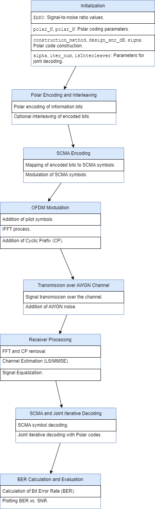
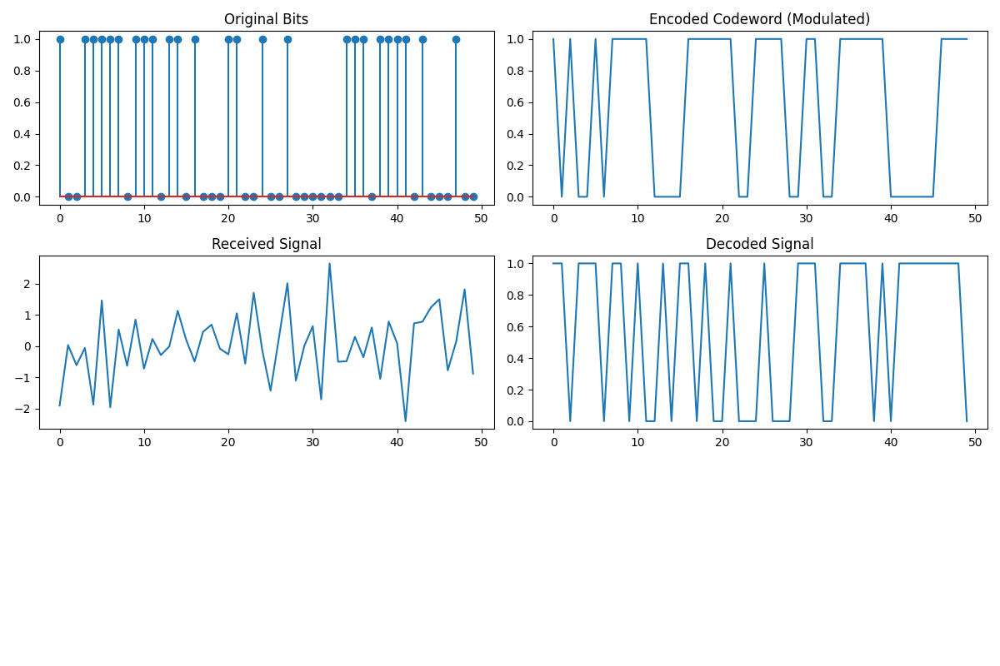

# Polar-6G-Sim

A Python simulation of a 6G communication link: polar-coded bits are pushed through a chosen channel model, then run through network slicing, resource allocation, mobility, interference management, edge computing, security, and energy-efficiency stages before Bit Error Rate (BER) is measured and plotted against SNR.



## What it simulates

- **Polar coding** — encoding/decoding via [`py-polar-codes`](https://pypi.org/project/py-polar-codes/) (Bhattacharyya-bound construction).
- **Channel models** — AWGN, IRS (intelligent reflecting surface), THz (high path-loss), joint communication & sensing, IAB (integrated access and backhaul), URLLC (Rayleigh fading), Massive MIMO, and NOMA.
- **Network slicing** — eMBB, URLLC, and mMTC profiles.
- **Resource allocation** — Round Robin, Proportional Fair, and a simplified Reinforcement-Learning-style allocator.
- **Mobility** — handover probability modeled from user speed.
- **Cross-cutting effects** — interference management, edge-computing offload delay, quantum-safe encryption, and energy-efficiency adjustments.
- **Evaluation** — BER computed across a sweep of SNR values (0–30 dB), reported as a table and plotted.

## Install

Requires Python 3.9+.

```bash
git clone https://github.com/yahya-khamaisi/polar-6g-sim.git
cd polar-6g-sim
python -m venv .venv && source .venv/bin/activate
pip install -r requirements.txt
```

## Usage

Interactive (prompts you to pick a channel):

```bash
python sim.py
```

Non-interactive, e.g. for scripting or CI:

```bash
python sim.py --channel THz --no-plot --save-plot results.png
```

| Flag | Description |
| --- | --- |
| `--channel` | One of `AWGN`, `IRS`, `THz`, `Sensing`, `IAB`, `URLLC`, `Massive MIMO`, `NOMA`. Skips the interactive prompt. |
| `--no-plot` | Don't open a plot window (useful headless). |
| `--save-plot PATH` | Save the results figure to `PATH`. |

## Example output

BER vs. SNR for the THz channel, plus the original bits / modulated signal / received signal traces:



## Project structure

```
polar-6g-sim/
├── sim.py            # simulation entry point (channels, slicing, allocation, BER eval)
├── requirements.txt
├── assets/           # diagrams, sample outputs, and reference data
└── README.md
```

## Notes

This is a research/teaching simulation, not a spec-compliant 6G stack — channel and impairment models are simplified approximations used to compare relative BER behavior across scenarios.
